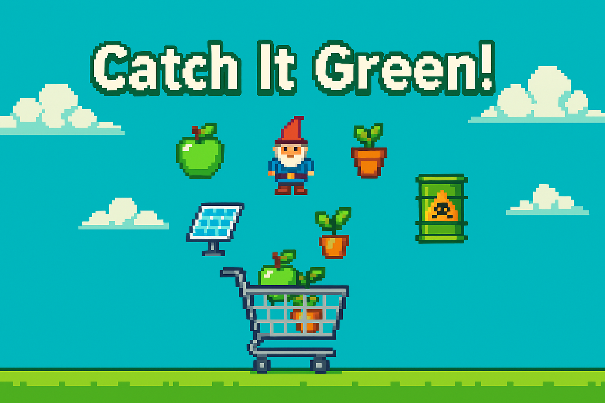

  

# 🎮 Catch It Green! 🌱

Welcome to **Catch It Green!**, a fast-paced mini-game where you collect eco-friendly products while dodging high-carbon footprint ones.  
Get ready to move your cart, sharpen your reflexes, and help the environment!

---

## 🕹️ How to Play

**Catch It Green!**

- **Take a look at the shopping list first!**  
- Use the **left** and **right** arrow keys to move the cart (swipe on mobile)
- **Catch as many low carbon footprint items** as you can to gain positive points!
- **Avoid high carbon footprint items** that will lower your score!

---

## 🌿 Special Challenge

If you collect all five items shown at the top of the screen, the supermarket will buy a tokenized carbon credit thanks to your eco-friendly shopping!

Can you complete the shopping list and become an eco-hero? 🌎🛒

---

## 🕵️‍♂️ Can you unlock the Mysterious Character?

Only the most sustainable shoppers — those scoring 330 points or more — will catch a glimpse of a secret pixel-art figure hidden deep in the game.
Think you’ve seen him? You have to do better than better! 👀🌱

---

## 📦 Built With

- **Visual Studio Code** (development environment)
- **HTML5**, **CSS3**, and **JavaScript** (core technologies)
- **Pixel art graphics** generated with **ChatGPT**
- **Main soundtrack** composed with **Suno.com**
- **Sound effects** sourced from **Mixkit.com**

---

>**The few things I know, I have also learned them by observing the work of others.
In the same spirit, I share my project — not only to be enjoyed and consulted but also in the hope that others may improve it.**

---

## 🚀 Play Now

👉 [Play Catch It Green!](https://vonniedermayer.github.io/Catch-It-Green/)

---

## 🔮 Future Updates

- More items
- New game modes
- Enhanced smartphone experience

## 📜 Credits

**Baked with love by Lorenzo Natali 🍪**  
Intended for bored recruiters, random gamers, sustainability enthusiasts, and pixel art lovers.  

---

## 📈 Project Goals

This project was created as a fun and creative way to combine:
- Sustainability education
- Gaming and pixel art
- My passion for programming

---

## 📢 Notes

- All icons and assets used are either generated or sourced from free-to-use platforms
- This game is designed to be lightweight and accessible from desktop devices (best experience)

---

## 💬 Suggestions

Have an idea to improve *Catch It Green*? Found a bug?
Feel free to open an [Issue](https://github.com/vonNiedermayer/Catch-It-Green/issues)!  
I welcome all feedback and suggestions.

---

## 🤝🏻 Connect with me

[LinkedIn Profile](https://www.linkedin.com/in/natalilorenzo) 

---

# 🎮💚 Let's Catch It Green!

